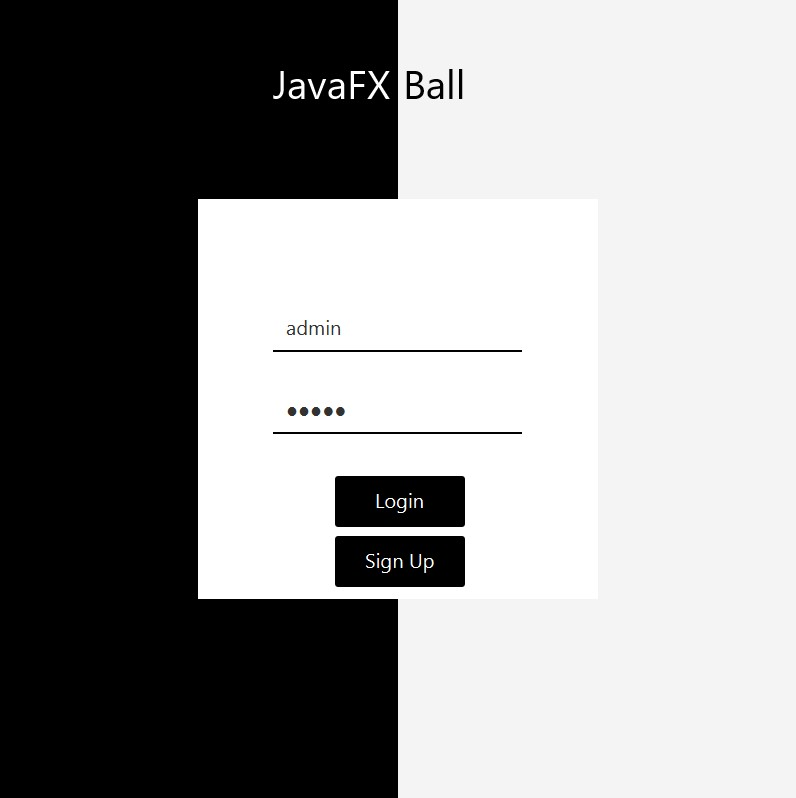
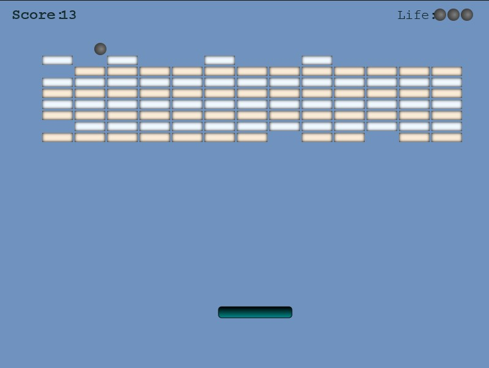

# javaFX-ball
javaFX-ball is a DX-Ball clone made using Java, JavaFX. It utilizes various object-oriented programming concepts of Java and JavaFX for GUI. The game was made as a project for CSE215

JavaFX Ball is a dynamic and engaging game where the player controls a paddle to hit a ball and break bricks. The objective is to clear all the bricks on the screen by bouncing the ball off the paddle and avoiding it from falling off the screen. The game offers multiple levels with varying difficulty, allowing players to test their skills and progress through challenging stages.

# Features:
Paddle and Ball Interaction: The game allows the player to control the movement of the paddle using input devices. The paddle is used to bounce the ball and prevent it from hitting the bottom of the screen.

Brick Breaking: The player aims to break bricks by hitting them with the ball which is made possible using collision detection and physics simulation. Each brick hit increases the player's score.

Event Handling: User interactions, such as button clicks and key presses, are abstracted through event handling mechanisms. The game captures these events and maps them to specific actions, such as starting the game, changing difficulty settings, or navigating between scenes. This ensures a responsive and interactive gameplay experience.

Scenes and Transitions: The game utilizes scenes and transitions to create a seamless flow between different game states, including the login scene, main menu, gameplay scene, and ending scene.

# Why use Java?
Java is currently one of the most broadly used fashionable-cause programming languages. Developers continually choose to develop games in a programming language that supports multithreading and uses OOP concepts for reusable code. Unlike different programming languages, Java allows to port applications from one platform to other platforms seamlessly.

# How was proj-HMS developed?
The project was made using JavaFX and OpenJDK. It uses various .java files for its classes, interfaces, abstract classes. It was made keeping in mind all concepts of Object Oriented Programming in JAVA. "shaheer-shamsi" acted as the team leader during the development of javaFX-ball.
